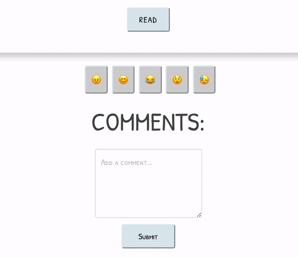

# 
# Project 4 - FLAGPIECES

By [Raquel Cruickshank](https://github.com/cruickshankrpc) + [Richard Bekoe](https://github.com/RichardBekoe)

## Overview

Richard and I built this full-stack application with a Python back-end and a React front-end using Mapbox & News APIs.\
Users can click on a country button on the interactive map and browse articles from multiple news outlets (BBC, Guardian, Al Jazeera etc).\
Once logged in users can:
  - Comment on articles.
  - 'React' to an article (😂😊😲😓😡).
  - Browse read articles on their 'Profile' page.
  - Browse aggregate of user articles with reactions on the 'Feed' page, and FILTER by reaction. 
  
[Take a look.](http://flagpieces.herokuapp.com/)

<!--  -->
<p align=center>

</p>

## Contents
  - [Overview](#overview)
  - [Contents](#contents)
  - [Brief](#brief)
  - [Technologies Used](#technologies-used)
  - [Approach](#approach)
  - [Wireframe](#wireframe)
  - [Build](#build)
  - [Wins & Challenges](#wins--challenges)
  - [Future Features](#future-features)

## Brief
- Build a full-stack application by making your own back-end and your own front-end.
- Use a Python Flask API using a Flask REST Framework to serve your data from a Postgres database.
- Consume your API with a separate front-end built with React.
- Be a complete product - multiple relationships and CRUD functionality for at least a couple of models.
- Implement thoughtful user stories/wireframes.
- Have a visually impressive design.
- Be deployed online so it's publicly accessible.

*Timeframe*: **1 week**

## Technologies Used
- HTML5
- SCSS
- JavaScript
- React
- PostgreSQL
- Python
- Flask
- SQLAlchemy 
- Marshmallow
- TablePlus
- Insomnia 
- Figma
- Trello
- Bcrypt 
- JWT
- Mapbox API
- News API
- Moment
- Bulma
- Axios

## Approach
We decided to use News API as our data source for our application. Due to it being continually updated, we decided not to scrape the data to our backend, and instead, fetch the data from the front.\
We began by planning out our user journey in Figma on the wireframe below: 

## Wireframe


We also roughly outlined the models and components we needed to build on Trello:


## Build 
We very much pair-programmed this project (aside from the MapBox and styling, which we did separately on the penultimate day) this made our build much slower but, ultimately, was a positive outcome as it ensured we had a thorough understanding of our build, and problem solving together was a great learning experience. 

Before building the map, we decided to make sure we could fetch the appropriate data. In our 'CountryArticles' component we used a prop:
```Javascript
const country = props.match.params.country
```
and template literal:

```Javascript
 useEffect(() => {
    axios.get(`https://newsapi.org/v2/everything?q=${country}&language=en&${API_KEY}`)
      .then(axiosResp => {
        setArticles(axiosResp.data.articles)
      })
  }, [country])
```
This would return articles, in English, with that country name in the headline or body of the text - a little hacky - but, given the limitations in the available country endpoints (fetching from a specific country returned articles in native language), we decided it was our best bet. 

In order for users to later retrieve their read articles, we needed to save them first to our backend, by making a POST request and attaching a reader ID:

```Python
@router.route("/countryarticles/article", methods=["POST"])
@secure_route
def create():
    article_response = request.get_json()
    article_response['reader_id'] = g.current_user.id

    try:
        article = article_schema.load(article_response)
    except ValidationError as e:
        return jsonify({"errors": e.messages, "message": "Something went wrong!"})

    article.save()
    return article_schema.jsonify(article), 201
```

In the component on the frontend, there is a dictionary of country flag emojis and their respective country names. Inside a handleSubmit function:
1. Each country is assigned a flag and saved to the backend using the article model. 
2. The page is pushed to the specific 'singlearticle' page using the ID of the article which has been saved to the database:
```Javascript
axios.post('/api/countryarticles/article', newItem
      , {
        headers: { Authorization: `Bearer ${token}` }
      }

    ).then((res) => props.history.push(`/singlearticle/${res.data.id}`))
```

### Single Article Page 
Here, users can read, react &/ comment on the article if they are logged in (we used JWT and secure routes for this).\
We used the **React Hook useState** and a handleSubmit function so that when a user clicks on a reaction, that reaction object is made and the reaction state is updated. Then, useEffect is called, which posts the reaction to the backend reaction model.\
For comments, I wrote a handleComment function to carry out an axios POST request to the backend to save the comment:

```Javascript
  function handleComment() {
    const token = localStorage.getItem('token')
    axios.post(`api/singlearticle/${id}/comments`, { content: comment }, {
      headers: { Authorization: `Bearer ${token}` }
    })
      .then(() => {
        setComment('')
        location.reload()
      })
  }
```
In JSX, I used the **map Array method** to display comments saved, and **moment** for the timestamp:
```Javascript
 <div className="comments-container">
          <h2>COMMENTS:</h2>
          <div className="comment-box">
            {articles.comments && articles.comments.map(comment => {
              return <div className="media-content" key={comment.id}>
                <div className="comment-content">
                  <p>{comment.content}</p>
                  <small>{moment(comment.created_at).calendar()}</small>
                </div>
              </div>
            })}
          </div>
        </div>
```
<!--  -->
<p align=center>

</p>

### Feed

On our Feed page we used a **useEffect hook**  to retrieve articles. Then, we used the **filter method** to filter through all the articles and then map over the array of reactions:


## Wins & Challenges 

Creating our models and figuring our our entity relationships took a long time, which was frustrating, and made our backend build slow. During my time at GA I realised that I lean more toward frontend development, as I relish visual design and considering user psychology. Although I was desperate to build the frontend, Richard's patience and need to thoroughly understand the backend architecture of our programme forced me to really get on board too, which was a great pay off. 

Given the limited amount of time I had to design, I am pleased that the frontend came together. Richard was a joy to work with, and gave me confidence in myself as a coder and problem solver. 

## Future Features
- Hoverable map without buttons.
- Delete & edit comments.
- Make reactions 'scalable'- each reaction image is attached to the article as a separate image each time it is clicked, a counter would maybe be better. 
- User avatars.
- Incorporate Material UI for Skeleton loading. 
